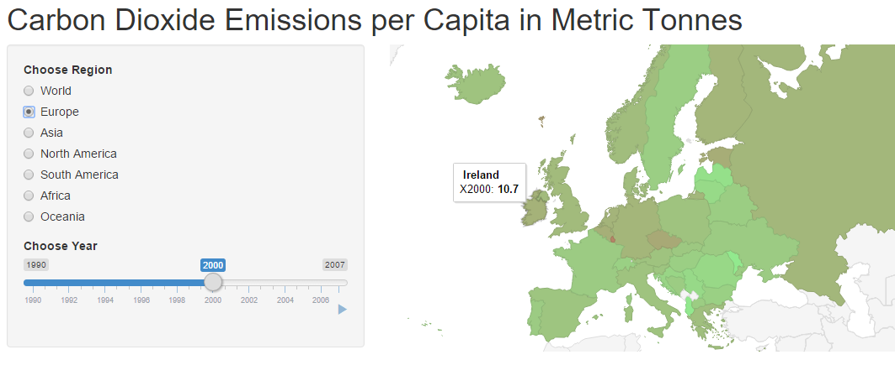

## Introduction

This is the month of COP21, the climate change conference in Paris, so it seemed appropriate to produce a shinyApp dealing with the issue of CO$_2$ emissions. The App, available at https://eugene100hickey.shinyapps.io/myapp, looks at annual CO$_2$ emissions per capita for countries around the globe. The year can be selected between 1990 and 2007. Emission levels are indicated by colour (light green for high-achievers, red for the polluters). The actual emission level can be seen by mouse hover.

The App also permits us to zoom in on a particular continent, the options are given as a series of radio buttons on left screen.

The data comes from wikipedia, specifically:  
https://en.wikipedia.org/wiki/List_of_countries_by_carbon_dioxide_emissions_per_capita.

--- .class #id 

## Example

```{r echo=F, message=F, warning=F}
library(RCurl)
library(XML)

url = getURL("https://en.wikipedia.org/wiki/List_of_countries_by_carbon_dioxide_emissions_per_capita")
CO2 <- readHTMLTable(url,which=2)

CO2 = CO2[, 1:20] # incomplete data from the years 2008 on
CO2 = CO2[-1,] # get rid of Qatar as its omissions are so great
CO2[CO2=='-'] = 1

names(CO2) = c("rank", "Country", 1990:2007)

cols = c(3:length(CO2));    
CO2[,cols] = apply(CO2[,cols], 2, function(x) as.numeric(as.character(x)))

CO2irl = subset(CO2, Country=='Ireland')
Co2i2000 = CO2irl[,'2000']

```

The image belows shows the App in action. The year 2000 is chosen, the geographical area of Europe is selected, and the mouse is placed over Ireland, showing carbon dioxide emissions of 10.7 tonnes per capita. We investigate by running an r chunk in slidify with result:  `r Co2i2000 `

  

<div style='text-align: center;'>
  
</div>

At a glance you can see that countries like Sweden and France do pretty well, Luxembourg and the Czech Republic not so much


--- .class #id

## Some Observations
From the image on the previous slide, you can see that countries like Sweden and France do pretty well, Luxembourg and the Czech Republic not so much. France does well because it generates so much energy from nuclear power stations, Sweden because of both nuclear and hydroelectric (Sweden's power consumption per capita is in fact well above European norms).

As we scroll through the years, overall we see very little change in CO$_2$ emissions. For Europe and North America there are gradual decreases. China, India, and Brazil see dramatic rises from much lower levels. Australia does badly. 

Emissions from developing nations are between 1% and 10% of those from Western nations. Emissions from oil producing countries were ridiculously high.


--- .class #id

## The Code

The code used in this App can be found at:

### UI.R -  
https://github.com/eugene100hickey/Developing_Data_Products/blob/master/ui.R

### server.R -    
https://github.com/eugene100hickey/Developing_Data_Products/blob/master/server.R


Note that server.R makes use of gvisGeoChart from the googleVis package.

